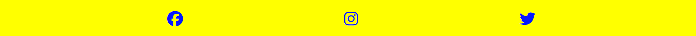
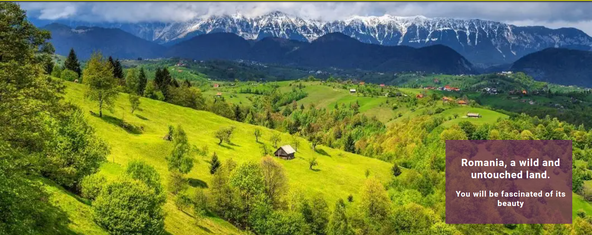
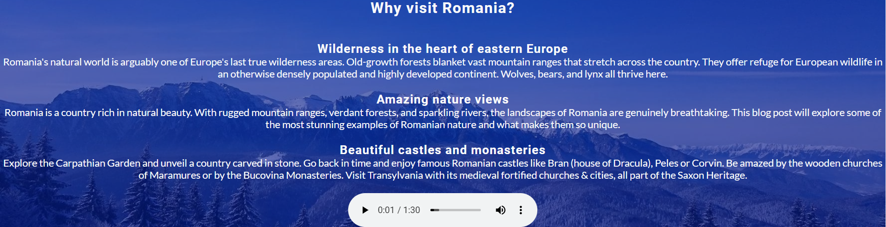

# Romania a wild and beautiful place

[Link to a live site](https://pauldmnn.github.io/Paul-First-Project/)

## Introduction

Welcome to my first project, part of the Code Institute Full Stack Development Course. The purpose of this project is to build a responsive website using HTML, CSS.

With this project i want to show people different beautiful places from Romania which i have visited through the years. 

Users will be able to navigate through the website using a functional navigation bar which will take the user to three different sections of the web-site. On the home page the user will be able to read about Romania and why visit Romania. There is a Photo section where I have included some photos from Romania. I have created a Feedback section which will allow the user to complete a form and submit feedback. 

#### Thank you for visiting Romania

## UX - User Experience Design

In the course I was taught about the User Experience Design and the importance of it. 
Below I have listed the 5 plains of UX: 

- The Strategy Plane
- The Scope Plane
- The Structure Plane
- The Skeleton Plane
- The Surface Plane

## The Strategy Plane

### Creator Goals

- I want webpage to be easy to navigate.
- I want webpage to be a user-friendly and responsive.
- I want users to be able to see what the site is about immidiately (on a home page).
- I want users to be motivated to leave feedback after visiting a webpage.

### User Stories

- As a user, I want to be able to navigate across the site to see different pages on a webpage.
- As a user, I want the purpose of a webpage to be clear so I can decide if the content is right for me.
- As a user, I want to see the photos in the website.
- As a user, I want to be able leave feedback and read about Romania in the website.

## The Scope Plane

I thought of the features I wanted to implement before designing the project, and a few of them were not achievable within my deadline. I decided to implement the ones covering my user stories first and add the remaining features later.

**Features implemented upon webpage release**

- Home Page with an introduction about Romania with some history and geografy about Romania.
- Functional navigation bar, allowing users to navigate to different pages.
- Photos page will allow useres to see different photos from Romania
- Feedback page will allow users to leave feedback about Romania
- Footer with links to social media.

## The Scope Plane

### Colors

Yellow:
- Navigation bar
- Header
- Footer
- Feedback text 

#3a3a3a:
- Hover button text
- Feedback button
- Header text

#fafafa :
- Text
- Borders

#0516ff :
- Footer text

### Fonts

Both fonts used in this project are Google Fonts.

#### Roboto :

- I used Roboto as the main font, as it's one of the most popular and user-friendly fonts. The Roboto font is easy to read even on the smallest devices and provides a positive user experience.

#### Lato :

- Lato font has been used for some headings but also for a navigation bar and menu section. Using a different font for these features helped me highlight important sections to user and made the website easier and quicker to navigate.

### Images

Most of the images are from my own gallery except one which was downloaded from:

- Google 

## The Skeleton Plane

I made some some changes to my project. Some features have become unnecessary or have caused poor user experience, so I decided to make them user friendly.

- The image and text for Why visit Romania was to bright and the user was unable to read the text so i introduced a background color with opacity so the user can read the text while still seeing the image in the background
  
[Feedback page ](assets/images/Feedback section before rectifying the error.jpg)

- The feedback form was covering the footer. I adjusted the size of the form and I made it to be within the header and the footer. 
- The textarea was not responsive for all screen types so i made it the same size for all screen types and to be responsive

## The Surface Plane

### Features present across the project 

### Navigation bar :

- Navabar is present on every page, fully responsive across all resolutions.
- Navbar toggles to a hamburger menu on mobile devices. 
- The user can navigate across the site freely.

**Desktop** : 

**Tablet**

**Mobile** :

### Footer :

- Footer is present on every page, for the user who wishes to navigate to the pages from the bottom, rather than having to scroll up.
- Footer contains social media links that are opening in a new tab.

### Hero images :

- Included to draw the user's attention and show the purpose of the website stright away.

**Desktop** :

**Tablet**

**Mobile** :

### Why visit section :

- The about section shows the purpose of the website right away, so the user can determine if this website is useful for him within the first few minutes.

### About section :

- The about section tells the user about the geograpgy and history of Romania

### Menu section :

- Menu section contains information about all cocktails and mocktails business is currently serving. 
- The user is also informed about new cocktails coming shortly.
- This section also includes video showing new cocktails to encourage users to visit Wizzards Tower.

### Contact form :

- Allows users to contact businesses with any inquiries.
- The user is also able to book activities or a table via a contact form.
- The user is able to provide feedback to the business. 

