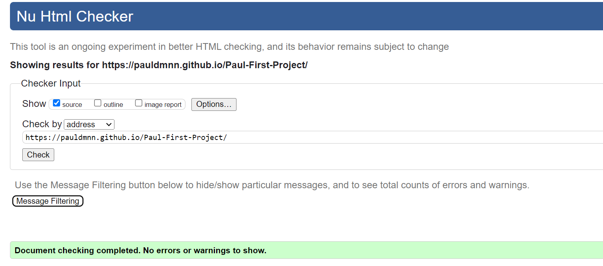

# Romania a wild and beautiful place

[Link to a live site](https://pauldmnn.github.io/Paul-First-Project/)

## Introduction

Welcome to my first project, part of the Code Institute Full Stack Development Course. The purpose of this project is to build a responsive website using HTML, CSS.

With this project i want to show people different beautiful places from Romania which i have visited through the years. 

Users will be able to navigate through the website using a functional navigation bar which will take the user to three different sections of the web-site. On the home page the user will be able to read about Romania and why visit Romania. There is a Photo section where I have included some photos from Romania. I have created a Feedback section which will allow the user to complete a form and submit feedback. 

#### Thank you for visiting Romania

## UX - User Experience Design

In the course I was taught about the User Experience Design and the importance of it. 
Below I have listed the 5 plains of UX: 

- The Strategy Plane
- The Scope Plane
- The Structure Plane
- The Skeleton Plane
- The Surface Plane

## The Strategy Plane

### Creator Goals

- I want webpage to be easy to navigate.
- I want webpage to be a user-friendly and responsive.
- I want users to be able to see what the site is about immidiately (on a home page).
- I want users to be motivated to leave feedback after visiting a webpage.

### User Stories

- As a user, I want to be able to navigate across the site to see different pages on a webpage.
- As a user, I want the purpose of a webpage to be clear so I can decide if the content is right for me.
- As a user, I want to see the photos in the website.
- As a user, I want to be able leave feedback and read about Romania in the website.

## The Scope Plane

I thought of the features I wanted to implement before designing the project, and a few of them were not achievable within my deadline. I decided to implement the ones covering my user stories first and add the remaining features later.

**Features implemented upon webpage release**

- Home Page with an introduction about Romania with some history and geografy about Romania.
- Functional navigation bar, allowing users to navigate to different pages.
- Photos page will allow useres to see different photos from Romania
- Feedback page will allow users to leave feedback about Romania
- Footer with links to social media.

## The Scope Plane

### Colors

Yellow:
- Navigation bar
- Header
- Footer
- Feedback text 

#3a3a3a:
- Hover button text
- Feedback button
- Header text

#fafafa :
- Text
- Borders

#0516ff :
- Footer text

### Fonts

Both fonts used in this project are Google Fonts.

#### Roboto :

- I used Roboto as the main font, as it's one of the most popular and user-friendly fonts. The Roboto font is easy to read even on the smallest devices and provides a positive user experience.

#### Lato :

- Lato font has been used for some headings but also for a navigation bar and menu section. Using a different font for these features helped me highlight important sections to user and made the website easier and quicker to navigate.

### Images

Most of the images are from my own gallery except one which was downloaded from:

- Wikipedia 

### Audio

The audio sound was downloaded from: 

- Mixkit

## The Skeleton Plane

I made some some changes to my project. Some features have become unnecessary or have caused poor user experience, so I decided to make them user friendly.

- The image and text for Why visit Romania was to bright and the user was unable to read the text so i introduced a background color with opacity so the user can read the text while still seeing the image in the background
  
[Feedback page ](assets/images/Feedback-section-before-rectifying-the-error.png)

- The feedback form was covering the footer. I adjusted the size of the form and I made it to be within the header and the footer. 
- The textarea was not responsive for all screen types so i made it the same size for all screen types and to be responsive

## The Surface Plane

### Features present across the project 

### Navigation bar :

- Navabar is present on every page, fully responsive across all resolutions.
- Navbar toggles to a hamburger menu on mobile devices. 
- The user can navigate across the site freely.

**Desktop** : 

**Tablet**

**Mobile** :

### Footer :

- Footer is present on every page, for the user who wishes to navigate to the pages from the bottom, rather than having to scroll up.
- Footer contains social media links that are opening in a new tab.

### Places images :

- Included to draw the user's attention and show the purpose of the website stright away.

**Desktop** :

**Tablet**

**Mobile** :

### Why visit section :

- The about section shows the purpose of the website right away, so the user can determine if this website is useful for him within the first few minutes.

### About section :

- The about section tells the user about the geograpgy and history of Romania

### Photos section :

- The Photos section contains nature and landmarks photos from Romania.
- The user will be able to see different places from Romania which I visited 

### Feedback form :

- This will allow the user to submit feedback about Romania and the website.
- The user must complete all fields in the form to be able to submit it.

## Testing

### Manual testing

- Navigation bar :
    - Navigation bar is fully responsive on large/medium/small resolutions.
    - All links to pages are working properly.
    - Hover CSS is correctly working.

- Footer :
    - Footer is fully responsive on large/medium/small resolutions.
    - Social media links are working and opening in a new tab.
    - Links to pages are working properly.

- Places image :
    - Image is responsive and adjusting to different screen size

- Why visit Romania:
    - Image is responsive and adjusting to different screen size

- Audio :
    - The audio player requires the play action to play the sound
    - The audio player is muted so the user will have to unmute to be able to hear the sound
    - The player works on all devices  
    - Menu and contact form background photos are linked correctly.
    - Images are successfully scaling on mobile devices. 

- Photos:
    - Grid system is working as intended successfully changing amount of collumns on smaller devices making website fully responsive. 

- Feedback form :
    - The form is working as intended.
    - The form is successfully redirecting the user to the "thank you" page.
    - Submit button is working correctly. 
    - The form is looking good on smaller devices.

- Thank you page :
    - The page is successfully appearing to the user after filling up the form.
    - The button taking the user back to the home page is working.

#### Devices used during testing:

- HP laptop
- Iphone 14 Pro Max
- Iphone 13 Pro

### Chrome Dev Tools

Chrome dev tools was used throughout the development of the project to test responsiveness. 
Responsiveness was tested using Dev Tools to emulate the following devices :

- Iphone SE
- Iphone XR
- Iphone 12 Pro
- Iphone 14 Pro Max
- Pixel 7
- Samsung Galaxy S8+
- Samsung Galaxy S20 Ultra
- iPad Mini
- iPad Air
- iPad Pro
- Surface Pro 7
- Surface Duo
- Galaxy Fold
- Samsung Galaxy A51/71
- Nest Hub
- Nest Hub Max

### Browser Testing

During development, webpage was mainly tested on Google Chrome. 
However, during testing process below browsers have been used :

- Google Chrome
- Microsoft Edge
- Safari

### Validation

[HTML validator](https://validator.w3.org/)

- 0 errors
- 0 warnings

[CSS validator](https://jigsaw.w3.org/css-validator/)

- 0 errors
- 0 warnings
- 0 info messages

### Bugs and Fixes

- The feedback form for larger screens was not contanied within the main:
    - Resolved by resizing the feedback form and made it to push the footer down. 
    

    - Bug fixed
     

## Deployment 

The master branch of this repository is the most current version and has been used for the deployed version of the site.
The Code Institiue student template was used to create this project.

[Code Institute Template ](https://github.com/Code-Institute-Org/ci-full-template)

1. Click **Use This Template** button.
2. Give your repository a name, and description.
3. Open [Github](https://github.com/) and log into your account.
4. Click **New Workspace** button.
5. Create a workspace from your project repository by creating a clone.

### Creating a clone

1. From the repository, click **Code**.
2. In the **Clone >> HTTPS** section, copy the clone URL for the repository.
3. Paste a link into the designated area on the github. 

### Forking

1. From the repository, click **Fork**.
2. Give your repository a name.
3. Click **Create fork**.

## Credits

### Images :

- Wikipedia

### Audio :

- Mixkit

[Birds chirping near a river](https://mixkit.co/free-sound-effects/nature/)

### Code :

- [Code Institute, Love running project](https://github.com/Code-Institute-Solutions/Love-Running-Solutions) :
    - Inspiration for the feedback page/form.

- [Font Awesome](https://fontawesome.com/) :
    - Used for all icons across the website.

### Photos

- I used my own gallery for this section 

## Thank you to everyone who read this documentation! 

